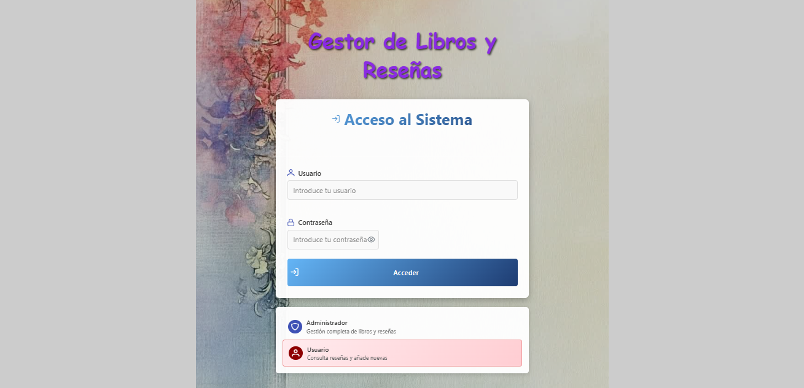
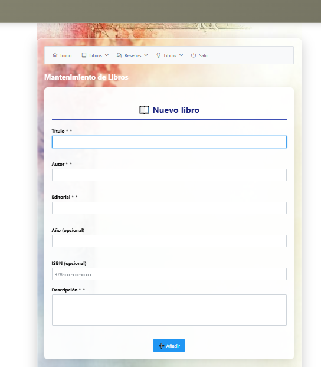
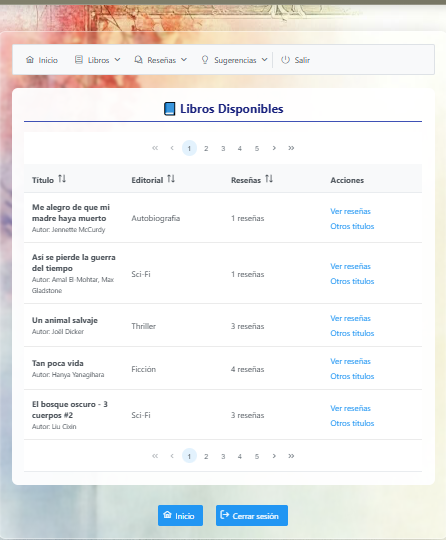

# Gestor de Libros y Reseñas

Aplicación web desarrollada en Java para la gestión de libros y reseñas, utilizando JavaServer Faces (JSF), servicios REST, JPA, Maven, GlassFish y MySQL.

El proyecto está compuesto por dos aplicaciones que trabajan conjuntamente:

* **LoginXPERIMENT**: servicio REST encargado de la autenticación de usuarios.
* **GestorLibrosResenias**: aplicación web JSF que consume el servicio REST y proporciona la interfaz de usuario.

## Tecnologías utilizadas

* Java
* JavaServer Faces (JSF)
* Jakarta RESTful Web Services (JAX-RS)
* CDI (Contexts and Dependency Injection)
* JPA
* Maven
* GlassFish Server
* MySQL
* Arquitectura MVC
* Patrón DAO

---

## Arquitectura del proyecto

El sistema está dividido en dos módulos:

### 1. LoginXPERIMENT

Servicio REST encargado de la autenticación.

Funciones principales:

* Validación de usuarios.
* Gestión de autorización.
* Exposición de endpoint REST para el inicio de sesión.

### 2. GestorLibrosResenias

Aplicación web desarrollada con JSF.

Funciones principales:

* Gestión de libros.
* Gestión de reseñas.
* Sistema de recomendaciones.
* Gestión de usuarios según rol.
* Exportación de datos CSV.
* Sistema de ayuda integrado.

---

## Funcionalidades

### Gestión de libros

Los administradores pueden:

* Crear libros.
* Modificar información.
* Eliminar registros.
* Gestionar datos como:

  * Título.
  * Autor.
  * Editorial.
  * Año de publicación.
  * ISBN.
  * Descripción.
  * Imagen de portada.

### Gestión de reseñas

Los usuarios autorizados pueden:

* Crear reseñas.
* Consultar reseñas existentes.
* Valorar libros mediante puntuaciones.
* Consultar comentarios de otros usuarios.

### Sistema de recomendaciones

El sistema incluye dos mecanismos de recomendación:

#### Recomendación por autor

Permite descubrir otros libros escritos por el mismo autor.

#### Recomendación por reseñas similares

Sugiere libros valorados positivamente por usuarios con gustos similares.

### Exportación de datos

La aplicación permite exportar el catálogo de libros en formato CSV.

### Sistema de ayuda

Incluye una sección de ayuda integrada con:

* Guía de uso.
* Funcionalidades por perfil.
* Preguntas frecuentes.

---

## Roles de usuario

### Administrador

Permisos:

* Gestión completa de libros.
* Consulta de reseñas.
* Acceso a recomendaciones.
* Exportación de datos.

### Lector

Permisos:

* Consulta de libros.
* Consulta de reseñas.
* Acceso a recomendaciones.

### Escritor de reseñas

Permisos:

* Consulta de libros.
* Creación de reseñas.
* Consulta de reseñas.
* Acceso a recomendaciones.

---

## Base de datos

La aplicación utiliza MySQL.

Entidades principales:

* Usuarios
* Perfiles
* Libros
* Reseñas
* Etiquetas
* Relación Libro-Etiqueta

Incluye script SQL para:

* Creación de la base de datos.
* Creación de usuarios.
* Creación de tablas.
* Inserción de datos de ejemplo.

---

## Capturas de pantalla

### Inicio de sesión

### Gestión de libros

### Detalle de libro

### Gestión de reseñas

### Recomendaciones por autor

### Recomendaciones por reseñas similares

### Ayuda integrada

---

## Configuración

### Requisitos

* JDK 17 o superior
* GlassFish Server
* MySQL
* Maven

### Pasos de instalación

1. Ejecutar el script SQL incluido en el proyecto.
2. Configurar la conexión a MySQL.
3. Desplegar el proyecto LoginXPERIMENT en GlassFish.
4. Desplegar el proyecto GestorLibrosResenias.
5. Acceder a la aplicación desde el navegador.

---

## Autor

Proyecto desarrollado como práctica académica del ciclo formativo de Desarrollo de Aplicaciones Multiplataforma (DAM).
